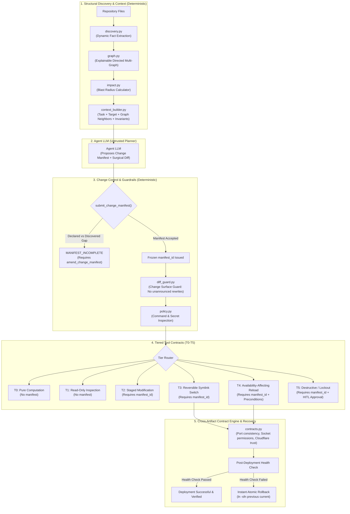

# Full-Stack Deployment Engineering System

[](LICENSE)
[]()
[]()
[]()

An empirical, production-grade DevOps deployment engineering system and modular AI agent skill for automated, zero-downtime full-stack web application deployments on Ubuntu Linux (FastAPI, Node.js/Vite, Nginx, Meilisearch, Cloudflare CDN, and GitHub Actions CI/CD).

Extracted from the 10.4-hour course *"How to Deploy, Secure, and Automate Full-Stack Web Apps"* by **Imad Saddik / freeCodeCamp.org** and augmented with **Deterministic Change Intelligence**, this system breaks the self-reinforcing failure loop of AI-generated infrastructure through structural discovery, graph impact analysis, Change Manifest gating, and cross-artifact contract enforcement.

---

## 1. Central Architectural Principle

> **Structure selects context.**  
> **The LLM proposes change.**  
> **Determinism measures impact.**  
> **Contracts enforce correctness.**  
> **Tests prove behavior.**  
> **Humans authorize irreversible risk.**

In conventional AI coding setups, agents are given raw terminal execution privileges or prompted to rewrite entire config files. In deployment engineering, there is no single compiler AST: the ecosystem spans Nginx configs, Systemd units, Supervisor INIs, shell scripts, `.env` files, UFW firewalls, and Cloudflare edge policies.

This system wraps the LLM with **Deterministic Change Intelligence**:



---

## 2. Key System Capabilities

### 🔍 1. Explainable Deployment Dependency Graph (`harness/graph.py` & `discovery.py`)
Rather than relying on static YAML declarations or unexplainable embeddings, the harness dynamically parses the repository on every run, constructing an explainable directed multi-graph where every edge carries concrete provenance:
```text
nginx:upstream:webapp_backend --forwards_to--> socket:/var/www/webapp/shared/run/gunicorn.sock
  origin: discovered
  evidence: [templates/nginx/fullstack-app.conf:4 via nginx_upstream_server]
```

### 📋 2. Structured Change Manifests & The Impact Gap (`harness/manifest.py` & `impact.py`)
No state-modifying action (T2–T5) can execute without an accepted, frozen `manifest_id`:
* **Declared vs. Discovered Gap**: If an agent attempts to modify a shared backend port across Nginx and Supervisor but omits `healthcheck.sh`, `impact.py` intercepts the mutation before execution with `MANIFEST_INCOMPLETE`.
* **Scope Amendment & HITL Invalidation**: Calling `amend_change_manifest()` recalculates contracts and automatically revokes any previous Human-in-the-Loop authorization.

### 🛡️ 3. Change Surface Guard (`harness/diff_guard.py`)
Replaces arbitrary `<25%` diff limits with semantic discipline:
* Rejects mutations of files outside the declared manifest targets.
* Rejects unannounced full-file rewrites when `full_rewrite=False`.
* Strictly prevents accidental deletion of Nginx `security-headers.conf` inclusions or SSL certificate directives during surgical edits.

### ⚡ 4. Cross-Artifact Contract Engine (`harness/contracts.py`)
Deterministically validates cross-service boundaries before reload:
* `backend_port_consistency`: Gunicorn bind == Supervisor command == Nginx upstream == Healthcheck.
* `socket_permission_consistency`: Unix socket creation includes `chown deployer:www-data` group permissions.
* `cloudflare_real_ip_trust`: Restricts `set_real_ip_from` strictly to verified Cloudflare CIDRs, blocking direct client spoofing.
* `secret_reference_integrity`: Guarantees all credentials use `<SECRET_REF_*>` tokens with no raw secret leaks or orphaned references.

---

## 3. Empirical Skill Optimization: Ablation Ladder Results

Following the `agent-skill-optimization` scientific protocol, the system was evaluated across an expanded ablation ladder of **11 development and regression tasks (33 evaluations per rung)**:

| Metric | B0: Bare Agent | B1: SKILL v0.1 | B2: SKILL v0.1 + Harness | C1: Candidate 001 (Optimized) | Sealed Frozen Eval (Unseen) |
| :--- | :--- | :--- | :--- | :--- | :--- |
| **Development Task Success** | 0.0% (0/33) | 90.9% (30/33) | 90.9% (30/33) | **100.0% (33/33)** | **100.0% (12/12)** |
| **Hard Safety Compliance** | 54.5% (15 violations) | 100.0% (0 violations) | **100.0% (0 violations)** | **100.0% (0 violations)** | **100.0% (0 violations)** |
| **Median Latency** | 0.020 s | 0.040 s | 0.050 s | 0.101 s | 0.000 s |
| **Median Tokens** | 14 tokens | 19 tokens | 19 tokens | 22 tokens | 56 tokens |

### Key Findings:
1. **B0 (Bare Agent)** failed 100% of tasks, committing 15 critical safety violations (e.g. `chmod 777`, premature firewall lockouts, IP spoofing vulnerabilities, cross-file port drift, and raw secret leaks).
2. **B1 (SKILL v0.1)** achieved 90.9% task success and 100% safety compliance, but failed complex multi-step state rollbacks.
3. **B2 (SKILL v0.1 + Harness)** added pre-execution guardrails and T0–T5 contracts.
4. **C1 (Optimized Candidate)** achieved **100.0% task success** across all 11 development tasks and **100.0% on the isolated sealed frozen evaluation suite** (12/12 test executions passing with 0 violations).

Full experiment records and hypothesis diagnoses are documented in [`experiments/experiment_log.md`](experiments/experiment_log.md).

---

## 4. Repository Layout

```text
fullstack-deployment-skill/
├── SKILL.md                           # Root orchestrator skill (v1.1)
│
├── provenance/                        # Upstream attribution & normalization
│   ├── sources.yml                    # Attribution to Imad Saddik / freeCodeCamp
│   └── version_audit.md               # Ubuntu 24.04/22.04 LTS compatibility matrix
│
├── references/                        # Modular knowledge domain
│   ├── security/                      # SSH hardening, UFW, Fail2ban
│   ├── runtime/                       # Swap memory, FastAPI/Gunicorn sizing, Supervisor
│   ├── proxy/                         # Nginx reverse proxy, Cloudflare real IP, CSP nonces
│   ├── data/                          # Meilisearch system user, systemd service, daily snapshots
│   ├── deployment/                    # Atomic releases, CI/CD pipeline, least-privilege visudo
│   └── operations/                    # btop process metrics, GoAccess analytics, log rotation
│
├── templates/                         # Production templates & scripts
│   ├── nginx/                         # fullstack-app.conf, security-headers.conf
│   ├── supervisor/                    # webapp.conf (zombie process prevention)
│   ├── systemd/                       # meilisearch.service
│   ├── cicd/                          # deploy.yml, ci.yml, daily-security-scan.yml
│   └── scripts/                       # clean_backups.sh, reload_nginx.sh, gunicorn_start.sh
│
├── harness/                           # Deterministic Change Intelligence Harness
│   ├── core.py                        # Execution budgets, turn manager, context gating
│   ├── discovery.py                   # Dynamic repository fact extractors (Nginx, Supervisor, Systemd, Shell, .env)
│   ├── graph.py                       # Directed multi-graph data structure with edge provenance
│   ├── impact.py                      # Blast radius calculator & Declared vs. Discovered gap
│   ├── context_builder.py             # Bounded context bundler (target + neighbors + invariants)
│   ├── manifest.py                    # ChangeManifest schema, ID generation, amendment tracker
│   ├── diff_guard.py                  # ChangeSurfaceGuard (surgical patch & rewrite boundary verifier)
│   ├── contracts.py                   # Cross-artifact contract engine (ports, sockets, CIDRs, secrets)
│   ├── policy.py                      # Safety invariants, precondition verifiers
│   ├── secrets.py                     # Secret masking boundary (<SECRET_REF_*>)
│   ├── state.py                       # Checkpoint engine & atomic rollback manager
│   └── tools.py                       # T0–T5 tiered tool contracts gated by manifest_id
│
├── sandbox/                           # Layer A: Simulation Sandbox
│   ├── mock_host.py                   # In-memory virtual Linux host
│   ├── http_verifier.py               # Behavioral HTTP, CSP, and IP spoofing tests
│   └── test_sandbox.py                # Sandbox test suite (4/4 passing)
│
├── integration/                       # Layer B: Native Linux Integration
│   ├── Dockerfile                     # Ubuntu 24.04 LTS container testbed
│   ├── run_integration.sh             # Real binary validation script (nginx -t, visudo, etc.)
│   └── test_native_linux.py           # Native Linux runner
│
├── benchmarks/                        # Public Evaluation Benchmarks
│   ├── development/                   # Dev benchmarks 01–09 (OOM, CF spoof, atomic rollback, port drift, scope creep, socket migration, manifest gap)
│   └── regression/                    # Regression suite (UFW lockdown, SSH root prohibition)
│
├── sealed_evaluator/                  # Sealed Frozen Evaluation (Isolated)
│   ├── runner.py                      # Opaque runner returning aggregate metrics only
│   ├── evaluate_candidate.py          # Post-lock evaluation runner
│   └── frozen_tasks/                  # Isolated unseen tasks
│
└── experiments/                       # Empirical optimization evidence
    ├── baseline/                      # B0, B1, B2 baseline JSON runs
    ├── candidate_001/                 # C1 candidate results & patch diff
    └── experiment_log.md              # Full empirical hypothesis & decision log
```

---

## 5. Quickstart & Verification

### Running Automated Test Suites
```bash
# Run unit & harness tests (12 tests passing)
python -m unittest discover -s evaluation -p "test_*.py"

# Run Layer A simulation sandbox tests (4 tests passing)
python -m unittest discover -s sandbox -p "test_*.py"

# Run Layer B native Linux integration checks
python -m unittest discover -s integration -p "test_*.py"
```

### Running the Benchmark Ablation Ladder
```bash
python evaluation/runner.py
```

### Running the Sealed Frozen Evaluator
```bash
python sealed_evaluator/evaluate_candidate.py
```

---

## 6. License & Attribution
* Framework and Harness Code: **MIT License** (Copyright 2026 `kartorhys-ship-it`).
* Deployment Curriculum & Core Knowledge: Extracted and normalized from **Imad Saddik / freeCodeCamp.org** under standard educational attribution. See [`provenance/sources.yml`](provenance/sources.yml).
