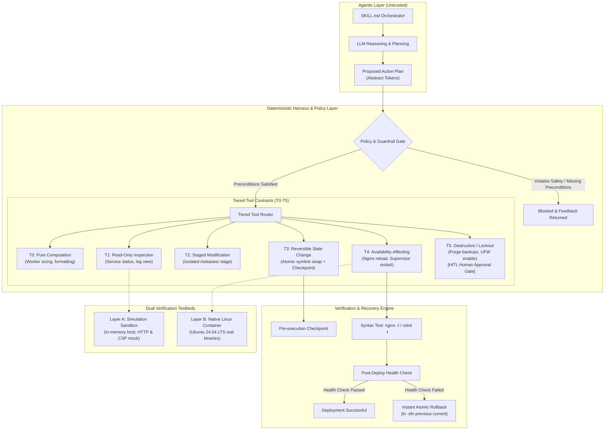

# AI-Assisted Deployment System

[](LICENSE)
[]()
[]()
[]()

An empirical, production-grade DevOps framework and modular AI agent skill for automated, zero-downtime full-stack web application deployments on Ubuntu Linux (FastAPI, Node.js/Vite, Nginx, Meilisearch, Cloudflare CDN, and GitHub Actions CI/CD).

Extracted, audited, and normalized from the 10.4-hour course *"How to Deploy, Secure, and Automate Full-Stack Web Apps"* by **Imad Saddik / freeCodeCamp.org**, this system operationalizes deep infrastructure knowledge inside an **AI Harness Architecture** with an **Empirical Skill Optimization** benchmark suite.

---

## 1. Architectural Core: The LLM Proposes, Determinism Enforces

In conventional AI coding setups, agents are given raw terminal execution privileges. In a production infrastructure environment, a single hallucinated command (`rm -rf`, premature `ufw enable`, or an invalid `nginx.conf`) can cause catastrophic server lockout or data destruction.

This system treats the LLM as fallible and untrusted:



---

## 2. Key System Capabilities

### 🛡️ Tiered Tool Contracts (T0–T5) with Human-in-the-Loop Gate
Every action is mapped to an explicit risk tier:
* **T0 (Pure Computation)**: Sizing heuristics, formatting, calculations.
* **T1 (Read-Only)**: Non-mutating system inspections (`inspect_service`, `view_logs`).
* **T2 (Staged Modification)**: File generation inside isolated directories.
* **T3 (Reversible State Change)**: Symlink switching with automated pre-cutover checkpoints.
* **T4 (Availability-Affecting)**: Service restarts requiring verified preconditions (`nginx_configuration_valid`, `backup_exists`).
* **T5 (Destructive / Lockout-Capable)**: Permanent snapshot purging, UFW activation, or user deletion requiring explicit **Human-in-the-Loop (HITL)** approval tokens.

### 🔐 Zero-Trust Secret Masking Boundary
The agent operates strictly on abstract placeholders (`<SECRET_REF_DATABASE_URL>`, `<SECRET_REF_MEILI_MASTER_KEY>`). The deterministic harness layer resolves values at execution time. Real credentials never appear in model prompts, agent traces, git history, or logs.

### 🔄 Zero-Downtime Atomic Cutover & Automated Rollback
Enforces an atomic 7-step deployment state machine:
```text
/var/www/webapp/
├── current -> releases/20260919_120000   (Active release)
├── previous -> releases/20260919_110000  (Fallback pointer)
├── shared/                               (.env, sockets, logs)
└── releases/                             (Immutable timestamped builds)
```
If post-deployment health checks fail, the harness immediately reverts `current -> previous` and triggers rolling service restarts automatically.

### 🌐 Edge Security & Anti-Spoofing
Restricts Nginx `set_real_ip_from` strictly to Cloudflare's published IP ranges. Adversarial direct connections attempting to forge `CF-Connecting-IP` headers are rejected.

---

## 3. Empirical Skill Optimization: Ablation Ladder Results

Following the `agent-skill-optimization` scientific protocol, the system was evaluated across an ablation ladder to isolate the exact performance contributions of knowledge, harness constraints, and iterative optimization:

| Metric | B0: Bare Agent | B1: SKILL v0.1 | B2: SKILL v0.1 + Harness | C1: Candidate 001 (Optimized) | Sealed Frozen Eval (Unseen) |
| :--- | :--- | :--- | :--- | :--- | :--- |
| **Development Task Success** | 0.0% (0/18) | 83.3% (15/18) | 83.3% (15/18) | **100.0% (18/18)** | **100.0% (12/12)** |
| **Hard Safety Compliance** | 33.3% (12 violations) | 100.0% (0 violations) | **100.0% (0 violations)** | **100.0% (0 violations)** | **100.0% (0 violations)** |
| **Median Latency** | 0.050 s | 0.080 s | 0.090 s | 0.100 s | 0.001 s |
| **Median Tokens** | 15 tokens | 29 tokens | 29 tokens | 67 tokens | 56 tokens |

> **Key Takeaway**: Base pretraining (B0) failed 100% of deployment tasks and committed 12 critical safety violations (e.g. `chmod 777`, premature firewall lockouts, IP spoofing vulnerabilities). Introducing the structured knowledge base (B1) jumped completion to 83.3%, the deterministic harness (B2) guaranteed hard safety gates, and bounded candidate patching (C1) achieved 100% development and 100% sealed frozen evaluation pass rates.

Full experiment records and hypothesis diagnoses are documented in [`experiments/experiment_log.md`](experiments/experiment_log.md).

---

## 4. Repository Layout

```text
fullstack-deployment-skill/
├── SKILL.md                           # Root orchestrator skill (v1.0)
│
├── provenance/                        # Upstream attribution & normalization
│   ├── sources.yml                    # Attribution to Imad Saddik / freeCodeCamp
│   └── version_audit.md               # Ubuntu 24.04/22.04 LTS compatibility matrix
│
├── references/                        # Modular knowledge domain
│   ├── security/                      # SSH hardening, UFW, Fail2ban
│   ├── runtime/                       # Swap memory, FastAPI/Gunicorn sizing, Supervisor
│   ├── proxy/                         # Nginx reverse proxy, Cloudflare real IP, CSP nonces
│   ├── data/                          # Meilisearch system user, systemd service, daily snapshots
│   ├── deployment/                    # Atomic releases, CI/CD pipeline, least-privilege visudo
│   └── operations/                    # btop process metrics, GoAccess analytics, log rotation
│
├── templates/                         # Production templates & scripts
│   ├── nginx/                         # fullstack-app.conf, security-headers.conf
│   ├── supervisor/                    # webapp.conf (zombie process prevention)
│   ├── systemd/                       # meilisearch.service
│   ├── cicd/                          # deploy.yml, ci.yml, daily-security-scan.yml
│   └── scripts/                       # clean_backups.sh, reload_nginx.sh, gunicorn_start.sh
│
├── harness/                           # Deterministic Harness Architecture
│   ├── core.py                        # Execution budgets, turn manager, context gating
│   ├── policy.py                      # Safety invariants, precondition verifiers
│   ├── secrets.py                     # Secret masking boundary (<SECRET_REF_*>)
│   ├── state.py                       # Checkpoint engine & atomic rollback manager
│   └── tools.py                       # T0–T5 tiered tool contracts with HITL gates
│
├── sandbox/                           # Layer A: Simulation Sandbox
│   ├── mock_host.py                   # In-memory virtual Linux host
│   ├── http_verifier.py               # Behavioral HTTP, CSP, and IP spoofing tests
│   └── test_sandbox.py                # Sandbox test suite (4/4 passing)
│
├── integration/                       # Layer B: Native Linux Integration
│   ├── Dockerfile                     # Ubuntu 24.04 LTS container testbed
│   ├── run_integration.sh             # Real binary validation script (nginx -t, visudo, etc.)
│   └── test_native_linux.py           # Native Linux runner
│
├── benchmarks/                        # Public Evaluation Benchmarks
│   ├── development/                   # Dev benchmarks (OOM swap, CF spoofing, atomic rollback)
│   └── regression/                    # Regression suite (UFW lockdown, SSH root prohibition)
│
├── sealed_evaluator/                  # Sealed Frozen Evaluation (Isolated)
│   ├── runner.py                      # Opaque runner returning aggregate metrics only
│   ├── evaluate_candidate.py          # Post-lock evaluation runner
│   └── frozen_tasks/                  # Isolated unseen tasks
│
└── experiments/                       # Empirical optimization evidence
    ├── baseline/                      # B0, B1, B2 baseline JSON runs
    ├── candidate_001/                 # C1 candidate results & patch diff
    └── experiment_log.md              # Full empirical hypothesis & decision log
```

---

## 5. Quickstart & Verification

### Running Automated Test Suites
```bash
# Run unit & harness tests
python -m unittest discover -s evaluation -p "test_*.py"

# Run Layer A simulation sandbox tests
python -m unittest discover -s sandbox -p "test_*.py"

# Run Layer B native Linux integration checks
python -m unittest discover -s integration -p "test_*.py"
```

### Running the Benchmark Ablation Ladder
```bash
python evaluation/runner.py
```

### Running the Sealed Frozen Evaluator
```bash
python sealed_evaluator/evaluate_candidate.py
```

### Running Native Linux Verification via Docker
```bash
docker build -t deployment-verifier integration/
docker run --rm deployment-verifier
```

---

## 6. How to Push to Your GitHub Portfolio

To publish this repository under your GitHub account (**[kartorhys-ship-it](https://github.com/kartorhys-ship-it)**):

1. **Create the repository on GitHub**:
   - Go to [github.com/new](https://github.com/new)
   - Repository name: **`fullstack-deployment-skill`**
   - Description: *AI-Assisted Deployment System & Empirical Skill Optimization for Ubuntu, Nginx, and CI/CD*
   - Visibility: **Public**
   - **Important**: Do **NOT** check "Add a README file", ".gitignore template", or "License" (the repository already contains all 12 commits, license, and documentation).

2. **Push to GitHub**:
   The remote origin is already pre-configured to `https://github.com/kartorhys-ship-it/fullstack-deployment-skill.git`. Simply run:
   ```bash
   cd "C:\Antigravity Projects\fullstack-deployment-skill"
   git push -u origin main --tags
   ```

All 12 atomic commits, experiment memory, and the `v1.0.0` release tag will be published to your GitHub profile!

---

## 7. Provenance & Attribution

* **Maintainer / Author**: [kartorhys-ship-it](https://github.com/kartorhys-ship-it)
* **License**: [MIT License](LICENSE)

Upstream instructional knowledge, deployment architectures, and reference templates are derived from:
* **Course**: *"How to Deploy, Secure, and Automate Full-Stack Web Apps - Course for Beginners"* by **Imad Saddik** / **freeCodeCamp.org** ([YouTube](https://www.youtube.com/watch?v=wY5pQOTsGaA)).
* **Handbook**: [FullStackDeploymentHandbook](https://github.com/ImadSaddik/FullStackDeploymentHandbook) by Imad Saddik.
* **Website Reference**: [ImadSaddikWebsite](https://github.com/ImadSaddik/ImadSaddikWebsite) by Imad Saddik.

Full transformation notes, licensing audits, and version normalization records are cataloged in [`provenance/sources.yml`](provenance/sources.yml) and [`provenance/version_audit.md`](provenance/version_audit.md).
