# Full-Stack Deployment Engineering System (Harness Prototype & Skill)

[](LICENSE)
[]()
[]()
[]()
[](https://github.com/kartorhys-ship-it/fullstack-deployment-skill/actions/workflows/ci.yml)

An experimental deterministic safety harness and modular AI agent skill for AI-assisted deployment engineering on Ubuntu Linux (FastAPI, Node.js/Vite, Nginx, Meilisearch, Cloudflare CDN, and GitHub Actions CI/CD). It demonstrates structured impact analysis, transactional change authorization, capability tiering, contract enforcement, simulated HITL controls, and containerized Linux configuration validation.

Extracted from the 10.4-hour course *"How to Deploy, Secure, and Automate Full-Stack Web Apps"* by **Imad Saddik / freeCodeCamp.org** and hardened with **Deterministic Change Intelligence**, this system breaks the self-reinforcing failure loop of AI-generated infrastructure through dynamic structural discovery, blast-radius impact analysis, transactional Change Manifest gating, out-of-band human approvals, and cross-artifact contract enforcement.

---

## 1. Central Architectural Principle

> **Structure selects context.**  
> **The LLM proposes change.**  
> **Determinism measures impact.**  
> **Contracts enforce correctness.**  
> **Tests prove behavior.**  
> **Humans authorize irreversible risk.**

In conventional AI coding setups, agents are given raw terminal execution privileges or prompted to rewrite entire config files. In deployment engineering, there is no single compiler AST: the ecosystem spans Nginx configs, Systemd units, Supervisor INIs, shell scripts, `.env` files, UFW firewalls, and Cloudflare edge policies.

This system wraps the LLM with **Deterministic Change Intelligence**:

```mermaid
flowchart TD
    subgraph DiscoveryLayer["1. Structural Discovery & Context (Deterministic)"]
        A[Repository Files] --> B["discovery.py\n(Dynamic Fact Extraction + Health Telemetry)"]
        B --> C["graph.py\n(Explainable Directed Multi-Graph)"]
        C --> D["impact.py\n(Blast Radius Calculator)"]
        D --> E["context_builder.py\n(Task + Target + Graph Neighbors + Invariants)"]
    end

    subgraph AgenticLayer["2. Agent LLM (Untrusted Planner)"]
        E --> F["Agent LLM\n(Proposes Change Manifest + Surgical Diff)"]
    end

    subgraph GatekeeperLayer["3. Change Control & Guardrails (Deterministic)"]
        F --> G{"AgentToolGateway.submit_manifest()"}
        G -- "Declared vs Discovered Gap" --> H["MANIFEST_INCOMPLETE\n(Requires amend_manifest)"]
        G -- "Manifest Accepted" --> I["Frozen manifest_id Issued"]
        I --> J["diff_guard.py\n(Change Surface Guard: Canonical exact targets)"]
        J --> K["policy.py\n(Command & Secret Inspection)"]
    end

    subgraph ExecutionLayer["4. Tiered Tool Contracts (T0-T5)"]
        K --> L{Tier Router}
        L --> T0["T0: Pure Computation\n(No manifest)"]
        L --> T1["T1: Read-Only Inspection\n(No manifest)"]
        L --> T2["T2: Staged Modification\n(Requires manifest_id)"]
        L --> T3["T3: Reversible Symlink Switch\n(Requires manifest_id)"]
        L --> T4["T4: Availability-Affecting Reload\n(Requires manifest_id + Prechecks)"]
        L --> T5["T5: Destructive / Lockout\n(Requires manifest_id + Bound HITL Approval)"]
    end

    subgraph VerificationLayer["5. Cross-Artifact Contract Engine & Recovery"]
        T3 & T4 --> M["contracts.py\n(Fail-closed invariants: Ports, Sockets, CIDRs, Secrets)"]
        M --> V1[Post-Deployment Health Check]
        V1 -- "Health Check Passed" --> S1[Deployment Successful & Verified]
        V1 -- "Health Check Failed" --> S2["Instant Atomic Rollback\n(ln -sfn previous current)"]
    end
```



---

## 2. Key System Capabilities

### 🔍 1. Explainable Deployment Dependency Graph (`harness/graph.py` & `discovery.py`)
Rather than relying on static YAML declarations or unexplainable embeddings, the harness dynamically parses the repository on every run, constructing an explainable directed multi-graph where every edge carries concrete provenance:
```text
nginx:upstream:webapp_backend --forwards_to--> socket:/var/www/webapp/shared/run/gunicorn.sock
  origin: discovered
  evidence: [templates/nginx/fullstack-app.conf:4 via nginx_upstream_server]
```

### 📋 2. Structured Change Manifests & The Impact Gap (`harness/manifest.py` & `impact.py`)
No state-modifying action (T2–T5) can execute without an accepted, frozen `manifest_id`:
* **Declared vs. Discovered Gap**: If an agent attempts to modify a shared backend port across Nginx and Supervisor but omits `healthcheck.sh`, `impact.py` intercepts the mutation before execution with `MANIFEST_INCOMPLETE`.
* **Scope Amendment & HITL Invalidation**: Calling `amend_change_manifest()` recalculates contracts and automatically revokes any previous Human-in-the-Loop authorization.

### 🛡️ 3. Change Surface Guard (`harness/diff_guard.py`)
Replaces arbitrary `<25%` diff limits with semantic discipline:
* Rejects mutations of files outside the declared manifest targets.
* Rejects unannounced full-file rewrites when `full_rewrite=False`.
* Strictly prevents accidental deletion of Nginx `security-headers.conf` inclusions or SSL certificate directives during surgical edits.

### ⚡ 4. Cross-Artifact Contract Engine (`harness/contracts.py`)
Deterministically validates cross-service boundaries before reload (fails closed on unknown or violated contracts):
* `backend_port_consistency`: Gunicorn bind == Supervisor command == Nginx upstream == Healthcheck.
* `socket_permission_consistency`: Unix socket creation includes `chown deployer:www-data` group permissions.
* `cloudflare_real_ip_trust`: Restricts `set_real_ip_from` strictly to verified Cloudflare CIDRs, blocking direct client spoofing.
* `secret_reference_integrity`: Guarantees all credentials use `<SECRET_REF_*>` tokens with no raw secret leaks or orphaned references.
* `backup_retention_policy`: Guarantees retention $\ge 7$ days and prevents targeting critical system directories.
* `swap_memory_guard`: Prevents insecure world-writable permissions on swap files.

---

## 3. Current Maturity & Security Model

> [!IMPORTANT]
> **Architecture Classification & Current Scope**:
> This repository is a **research prototype and safety harness** exploring deterministic change control for AI-driven infrastructure engineering. It introduces mathematically and structurally bounded guardrails around non-deterministic LLMs before mutations touch host systems.

### 🔒 Hardened Security Boundaries
1. **Out-of-Band Human-in-the-Loop (HITL)**: Destructive and lockout actions (Tier T5, e.g. UFW firewall changes or database snapshot purging) strictly require a **hashed approval record prototype** generated through an out-of-band operator service ([`harness/approvals.py:TrustedApprovalService`](harness/approvals.py)). Approvals are bound to `(manifest_id, version, action, action_hash)`, where `action_hash = SHA256(canonical_json(action + arguments))` prevents parameter substitution attacks. The agent's tool surface has no self-approval capabilities.
2. **Capability Facade (`AgentToolGateway`)**: The agent interacts exclusively through [`AgentToolGateway`](harness/core.py), preventing direct invocation of internal tools or bypass of contract verification gates.
3. **Transactional Change Manifest State Machine**: All state-modifying actions (T2–T5) require an accepted `manifest_id` managed via a strict lifecycle (`DRAFT` $\rightarrow$ `PENDING_VALIDATION` $\rightarrow$ `ACCEPTED`). Manifest amendments are transactionally staged and automatically roll back on validation failure.
4. **Strict Canonical Path Discipline**: Targets and blast radii enforce canonical relative path matching ([`harness/manifest.py:canonicalize_path`](harness/manifest.py)). Traversal sequences (`..`), absolute path escapes, and fuzzy substring matches are rejected before evaluation.
5. **Fail-Closed Contract Engine**: Cross-artifact contracts ([`harness/contracts.py`](harness/contracts.py)) fail closed: unknown contract types raise `UnknownContractError`, and any failed invariant raises `ContractViolation` before mutating execution proceeds.
6. **Preconditions & Host Probes**: Prechecks are cleanly decoupled via [`HostProbeAdapter`](harness/tools.py), with local repository heuristic checks during prototyping and native Linux binary execution in containerized environments.
7. **Discovery Telemetry**: Dynamic repository fact extraction tracks parsing health (`DiscoveryHealth.parse_failures`). If a declared manifest target file fails structural parsing, mutations are blocked with `MANIFEST_INCOMPLETE`.

### 🧪 Verification Architecture & Methodology
- **Layer A (Simulation Sandbox - `sandbox/`)**: Fast, in-memory virtual Linux host and mock HTTP verifier testing atomic cutovers, symlink swaps, and Cloudflare header spoofing defenses.
- **Layer B (Native Linux Testbed - `integration/`)**: Containerized Ubuntu 24.04 LTS runner testing actual system binaries (`nginx -t`, `visudo -cf`, and systemd unit analyzers) inside a pristine root container via Docker.
- **Deterministic Fixture Validation (`benchmarks/`, `sealed_evaluator/`)**: Evaluates deterministic response fixtures representing distinct agent archetypes (unconstrained F0 vs domain-structured F3) against invariant specifications to prove that the harness reliably permits safe actions and halts unsafe operations. *(Note: Reported fixture execution times and token counts measure local test execution heuristics; live multi-turn cloud LLM evaluation is tracked for subsequent releases).*

---

## 4. Deterministic Fixture Validation: Ablation Ladder Results

Following the `agent-skill-optimization` scientific protocol, the system was evaluated across an expanded ablation ladder of **11 development and regression tasks (33 evaluations per rung)**:

| Metric | F0: Unsafe Baseline Fixture | F1: Skill-Compliant Fixture | F2: Harness-Aware Fixture | F3: Optimized Fixture (Change Intelligence) | Isolated Evaluation Fixture |
| :--- | :--- | :--- | :--- | :--- | :--- |
| **Development Task Success** | 0.0% (0/33) | 90.9% (30/33) | 90.9% (30/33) | **100.0% (33/33)** | **100.0% (12/12)** |
| **Hard Safety Compliance** | 54.5% (15 violations) | 100.0% (0 violations) | **100.0% (0 violations)** | **100.0% (0 violations)** | **100.0% (0 violations)** |
| **Median Latency** | 0.020 s | 0.040 s | 0.050 s | 0.101 s | 0.000 s |
| **Median Tokens** | 14 tokens | 19 tokens | 19 tokens | 22 tokens | 56 tokens |

### Key Findings:
1. **F0 (Unsafe Baseline Fixture)** fails 100% of tasks, committing 15 critical safety violations (e.g. `chmod 777`, premature firewall lockouts, IP spoofing vulnerabilities, cross-file port drift, and raw secret leaks), proving the evaluator catches obvious security regressions.
2. **F1 (Skill-Compliant Fixture)** achieves 90.9% task success and 100% safety compliance, but fails complex multi-step state rollbacks.
3. **F2 (Harness-Aware Fixture)** validates manifest expectations and pre-execution guardrails.
4. **F3 (Optimized Fixture)** achieves **100.0% task success** across all 11 development tasks and **100.0% on the isolated benchmark fixtures** (12/12 test executions passing with 0 violations).

Full experiment records and hypothesis diagnoses are documented in [`experiments/experiment_log.md`](experiments/experiment_log.md).

---

## 5. Repository Layout

```text
fullstack-deployment-skill/
├── .github/
│   └── workflows/ci.yml               # Multi-platform CI (Ubuntu & Windows matrix across Python 3.11/3.12)
│
├── SKILL.md                           # Root orchestrator skill (v1.2)
│
├── provenance/                        # Upstream attribution & normalization
│   ├── sources.yml                    # Attribution to Imad Saddik / freeCodeCamp
│   └── version_audit.md               # Ubuntu 24.04/22.04 LTS compatibility matrix
│
├── references/                        # Modular knowledge domain
│   ├── security/                      # SSH hardening, UFW, Fail2ban
│   ├── runtime/                       # Swap memory, FastAPI/Gunicorn sizing, Supervisor
│   ├── proxy/                         # Nginx reverse proxy, Cloudflare real IP, CSP nonces
│   ├── data/                          # Meilisearch system user, systemd service, daily snapshots
│   ├── deployment/                    # Atomic releases, CI/CD pipeline, least-privilege visudo
│   └── operations/                    # btop process metrics, GoAccess analytics, log rotation
│
├── templates/                         # Production templates & scripts
│   ├── nginx/                         # fullstack-app.conf, security-headers.conf
│   ├── supervisor/                    # webapp.conf (zombie process prevention)
│   ├── systemd/                       # meilisearch.service
│   ├── cicd/                          # deploy.yml, ci.yml, daily-security-scan.yml
│   └── scripts/                       # clean_backups.sh, reload_nginx.sh, gunicorn_start.sh
│
├── harness/                           # Deterministic Change Intelligence Harness
│   ├── approvals.py                   # Out-of-band TrustedApprovalService (hashed approval records with parameter binding)
│   ├── core.py                        # Execution budgets, AgentToolGateway capability facade & contract gating
│   ├── discovery.py                   # Dynamic repository fact extractors with DiscoveryHealth telemetry
│   ├── graph.py                       # Directed multi-graph data structure with edge provenance
│   ├── impact.py                      # Blast radius calculator & canonical Declared vs. Discovered gap
│   ├── context_builder.py             # Bounded context bundler (target + neighbors + invariants)
│   ├── manifest.py                    # Transactional ChangeManifest state machine & path canonicalizer
│   ├── diff_guard.py                  # ChangeSurfaceGuard (canonical surgical patch boundary verifier)
│   ├── contracts.py                   # Fail-closed cross-artifact contract engine (ports, sockets, CIDRs, secrets, retention, swap)
│   ├── policy.py                      # Safety invariants, precondition verifiers
│   ├── secrets.py                     # Secret masking boundary (<SECRET_REF_*>)
│   ├── state.py                       # Checkpoint engine & atomic rollback manager
│   └── tools.py                       # T0–T5 tiered tool contracts with HostProbeAdapter capability interface
│
├── sandbox/                           # Layer A: Simulation Sandbox
│   ├── mock_host.py                   # In-memory virtual Linux host
│   ├── http_verifier.py               # Behavioral HTTP, CSP, and IP spoofing tests
│   └── test_sandbox.py                # Sandbox test suite (4/4 passing)
│
├── integration/                       # Layer B: Native Linux Integration
│   ├── Dockerfile                     # Ubuntu 24.04 LTS container testbed
│   ├── run_integration.sh             # Real binary validation script (nginx -t, visudo, etc.)
│   └── test_native_linux.py           # Native Linux runner
│
├── benchmarks/                        # Public Evaluation Benchmarks
│   ├── development/                   # Dev benchmarks 01–09 (OOM, CF spoof, atomic rollback, port drift, scope creep, socket migration, manifest gap)
│   └── regression/                    # Regression suite (UFW lockdown, SSH root prohibition)
│
├── sealed_evaluator/                  # Isolated Benchmark Evaluator
│   ├── runner.py                      # Opaque runner returning aggregate metrics only
│   ├── evaluate_candidate.py          # Post-lock evaluation runner
│   └── frozen_tasks/                  # Immutable benchmark tasks
│
└── experiments/                       # Empirical optimization evidence
    ├── baseline/                      # B0, B1, B2 baseline JSON runs
    ├── candidate_001/                 # C1 candidate results & patch diff
    └── experiment_log.md              # Full empirical hypothesis & decision log
```

---

## 6. Quickstart & Verification

### Running Automated Test Suites
```bash
# Run unit & hardened security tests (20 tests passing)
python -m unittest discover -s evaluation -p "test_*.py"

# Run Layer A simulation sandbox tests (4 tests passing)
python -m unittest discover -s sandbox -p "test_*.py"

# Run Layer B native Linux integration checks
python -m unittest discover -s integration -p "test_*.py"
```

### Running the Benchmark Ablation Ladder
```bash
python evaluation/runner.py
```

### Running the Isolated Benchmark Evaluator
```bash
python sealed_evaluator/evaluate_candidate.py
```

---

## 7. License & Attribution
* Framework and Harness Code: **MIT License** (Copyright 2026 `kartorhys-ship-it`).
* Deployment Curriculum & Core Knowledge: Extracted and normalized from **Imad Saddik / freeCodeCamp.org** under standard educational attribution. See [`provenance/sources.yml`](provenance/sources.yml).
